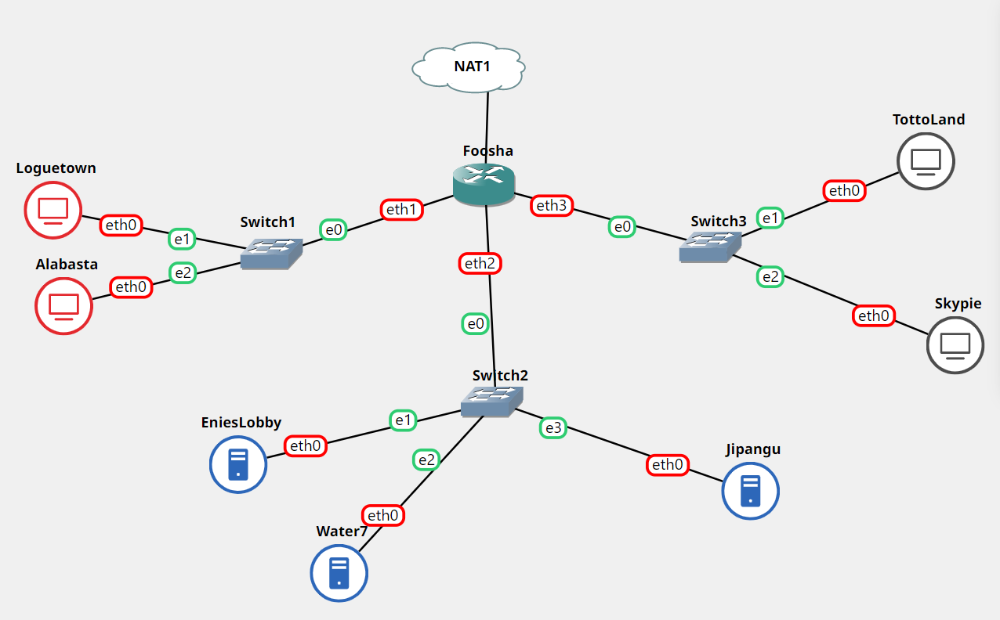
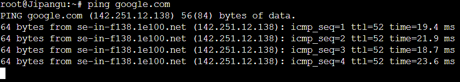
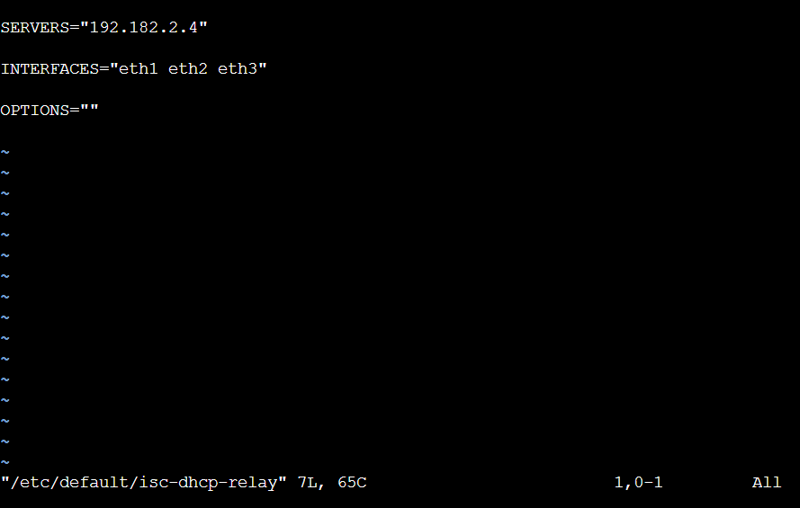
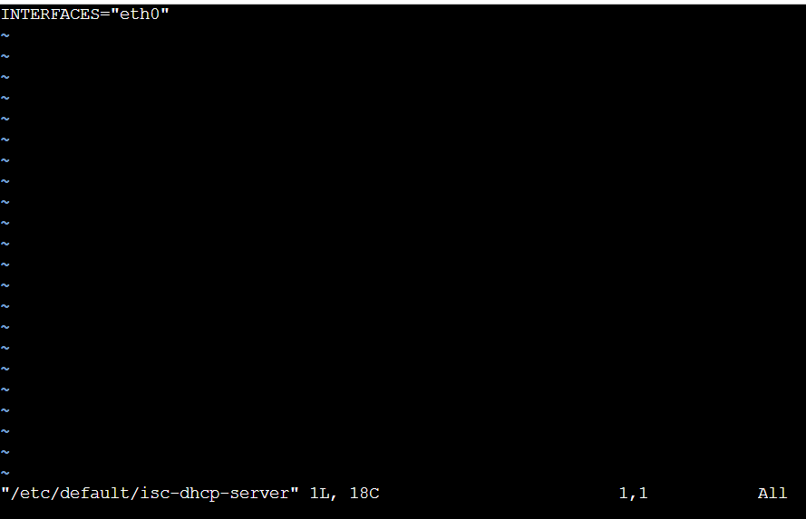
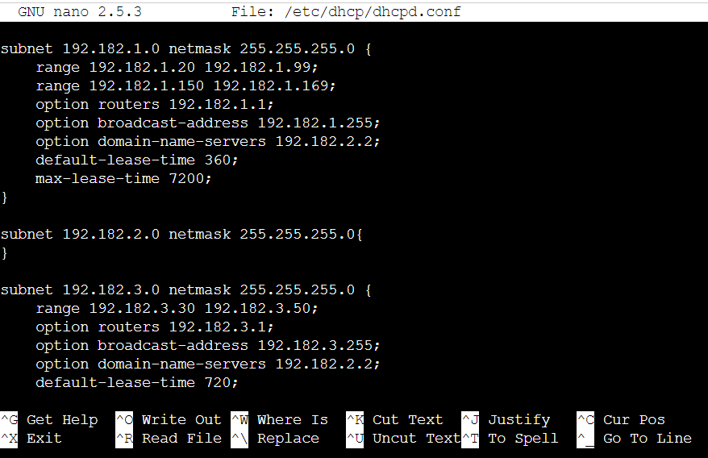
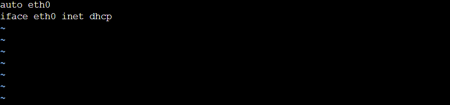

# Jarkom-Modul-3-B11-2021

## **Kelompok B-11**
|NRP           |Nama                   |
|:------------:|:---------------------:|
|05111940000079|Muhammad Nevin         |
|05111940000116|Albert Filip Silalahi  |
|05111940000132|Jagad Wijaya Purnomo   |


## Soal 1
Luffy bersama Zoro berencana membuat peta tersebut dengan kriteria EniesLobby sebagai DNS Server, Jipangu sebagai DHCP Server, Water7 sebagai Proxy Server 

### Jawaban
Membuat topologi sebagai berikut:


Lakukan setting network masing-masing node dengan fitur `Edit network configuration` dengan setting sebagai berikut:

**Foosha (sebagai Router / DHCP Relay)**
```
auto eth0
iface eth0 inet dhcp

auto eth1
iface eth1 inet static
	address 192.182.1.1
	netmask 255.255.255.0

auto eth2
iface eth2 inet static
	address 192.182.2.1
	netmask 255.255.255.0

auto eth3
iface eth3 inet static
	address 192.182.3.1
	netmask 255.255.255.0
```

**Loguetown (sebagai Client)**
```
auto eth0
iface eth0 inet dhcp
```

**Alabasta (sebagai Client)**
```
auto eth0
iface eth0 inet dhcp
```

**EniesLobby (sebagai DNS Master)**
```
auto eth0
iface eth0 inet static
	address 192.182.2.2
	netmask 255.255.255.0
	gateway 192.182.2.1
```

**Water7 (sebagai Proxy Server)**
```
auto eth0
iface eth0 inet static
	address 192.182.2.3
	netmask 255.255.255.0
	gateway 192.182.2.1
```

**Jipangu (sebagai DHCP Server)**
```
auto eth0
iface eth0 inet static
	address 192.182.2.4
	netmask 255.255.255.0
	gateway 192.182.2.1
```

**Skypie (sebagai Client)**
```
auto eth0
iface eth0 inet static
	address 192.182.3.2
	netmask 255.255.255.0
	gateway 192.182.3.1
```

**TottoLand (sebagai Client)**
```
auto eth0
iface eth0 inet dhcp
```

Ketikkan `iptables -t nat -A POSTROUTING -o eth0 -j MASQUERADE -s 192.181.0.0/16` pada router `Foosha`.

Ketikkan `echo nameserver 192.168.122.1 > /etc/resolv.conf` pada node ubuntu yang lain.

Restart semua node dan coba `ping google.com`. Berikut bukti `Jipangu` dapat mengakses internet.



## Soal 2
dan Foosha sebagai DHCP Relay.  Luffy dan Zoro menyusun peta tersebut dengan hati-hati dan teliti.

### Jawaban
**Pada Foosha**
- Install aplikasi isc-dhcp-relay.

  ```
  apt-get install isc-dhcp-relay -y
  ```
- Edit file `/etc/default/isc-dhcp-relay` seperti pada gambar berikut:

  
- Restart isc-dhcp-relay.

  ```
  service isc-dhcp-relay restart
  ```


## Soal 3
Client yang melalui Switch1 mendapatkan range IP dari [prefix IP].1.20 - [prefix IP].1.99 dan [prefix IP].1.150 - [prefix IP].1.169

### Jawaban
**Pada Jipangu**
- Install aplikasi isc-dhcp-server.

  ```
  apt-get install isc-dhcp-server -y
  ```
- Edit file `/etc/default/isc-dhcp-server` seperti pada gambar berikut:

  
- Edit file `/etc/dhcp/dhcpd.conf` seperti pada gambar berikut:

  
- Restart isc-dhcp-server.

  ```
  service isc-dhcp-server restart
  ```

**Pada Loguetown**
- Edit file `/etc/network/interfaces` seperti pada gambar berikut:

  
- Restart Loguetown dengan klik stop dan start pada node Loguetown.
- Lakukan testing pada IP dan nameserver.


**Pada Alabasta**
- Edit file `/etc/network/interfaces` seperti pada gambar berikut:

  
- Restart Alabasta dengan klik stop dan start pada node Alabasta.
- Lakukan testing pada IP dan nameserver.

		

## Soal 4
Client yang melalui Switch3 mendapatkan range IP dari [prefix IP].3.30 - [prefix IP].3.50.

### Jawaban
**Pada Jipangu**
- Edit file `/etc/dhcp/dhcpd.conf` seperti pada gambar berikut:

  
- Restart isc-dhcp-server.

  ```
  service isc-dhcp-server restart
  ```

**Pada TottoLand**
- Edit file `/etc/network/interfaces` seperti pada gambar berikut:

  
- Restart TottoLand dengan klik stop dan start pada node TottoLand.
- Lakukan testing pada IP dan nameserver.

  

## Soal 5
Client mendapatkan DNS dari EniesLobby dan client dapat terhubung dengan internet melalui DNS tersebut.

### Jawaban
**Pada EniesLobby**
- Install aplikasi bind9.

  ```
  apt-get install bind9 -y
  ```
- Edit file `/etc/bind/named.conf.options` seperti pada gambar berikut:

  
- Restart bind9.

  ```
  service bind9 restart
  ```

**Pada Loguetown**
- Lakukan ping `google.com`.

  

**Pada Alabasta**
- Lakukan ping `google.com`.

  

**Pada Skypie**
- Lakukan ping `google.com`.

  

**Pada TottoLand**
- Lakukan ping `google.com`.

  

## Soal 6
Lama waktu DHCP server meminjamkan alamat IP kepada Client yang melalui Switch1 selama 6 menit sedangkan pada client yang melalui Switch3 selama 12 menit. Dengan waktu maksimal yang dialokasikan untuk peminjaman alamat IP selama 120 menit.

### Jawaban
**Pada Jipangu**
- Edit file `/etc/dhcp/dhcpd.conf` pada bagian `default-lease-time` dan `max-lease-time` seperti pada gambar berikut:

  
  
  
- Restart isc-dhcp-server.

  ```
  service isc-dhcp-server restart
  ```

## Soal 7
Luffy dan Zoro berencana menjadikan Skypie sebagai server untuk jual beli kapal yang dimilikinya dengan alamat IP yang tetap dengan IP [prefix IP].3.69.

### Jawaban
**Pada Jipangu**
- Edit file `/etc/dhcp/dhcpd.conf` seperti pada gambar berikut:
  
  
- Restart isc-dhcp-server.

  ```
  service isc-dhcp-server restart
  ```

**Pada Skypie**
- Edit file `/etc/network/interfaces` seperti pada gambar berikut:

  
- Restart Skypie dengan klik stop dan start pada node Skypie.
- Lakukan testing pada IP dan nameserver.

  


## Soal 8
Loguetown digunakan sebagai client Proxy agar transaksi jual beli dapat terjamin keamanannya, juga untuk mencegah kebocoran data transaksi.
Pada Loguetown, proxy harus bisa diakses dengan nama jualbelikapal.yyy.com dengan port yang digunakan adalah 5000

### Jawaban


## Soal 9
Agar transaksi jual beli lebih aman dan pengguna website ada dua orang, proxy dipasang autentikasi user proxy dengan enkripsi MD5 dengan dua username, yaitu luffybelikapalyyy dengan password luffy_yyy dan zorobelikapalyyy dengan password zoro_yyy 

### Jawaban


## Soal 10
Transaksi jual beli tidak dilakukan setiap hari, oleh karena itu akses internet dibatasi hanya dapat diakses setiap hari Senin-Kamis pukul 07.00-11.00 dan setiap hari Selasa-Jum’at pukul 17.00-03.00 keesokan harinya (sampai Sabtu pukul 03.00) 

### Jawaban


## Soal 11
Agar transaksi bisa lebih fokus berjalan, maka dilakukan redirect website agar mudah mengingat website transaksi jual beli kapal. Setiap mengakses google.com, akan diredirect menuju super.franky.yyy.com dengan website yang sama pada soal shift modul 2. Web server super.franky.yyy.com berada pada node Skypie 

### Jawaban


## Soal 12
Saatnya berlayar! Luffy dan Zoro akhirnya memutuskan untuk berlayar untuk mencari harta karun di super.franky.yyy.com. Tugas pencarian dibagi menjadi dua misi, Luffy bertugas untuk mendapatkan gambar (.png, .jpg), sedangkan Zoro mendapatkan sisanya. Karena Luffy orangnya sangat teliti untuk mencari harta karun, ketika ia berhasil mendapatkan gambar, ia mendapatkan gambar dan melihatnya dengan kecepatan 10 kbps

### Jawaban


## Soal 13
Sedangkan, Zoro yang sangat bersemangat untuk mencari harta karun, sehingga kecepatan kapal Zoro tidak dibatasi ketika sudah mendapatkan harta yang diinginkannya

### Jawaban
